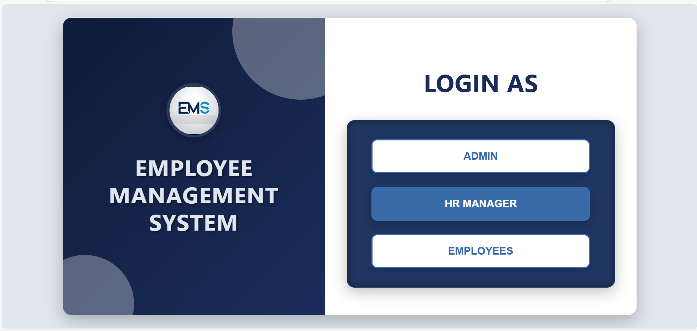
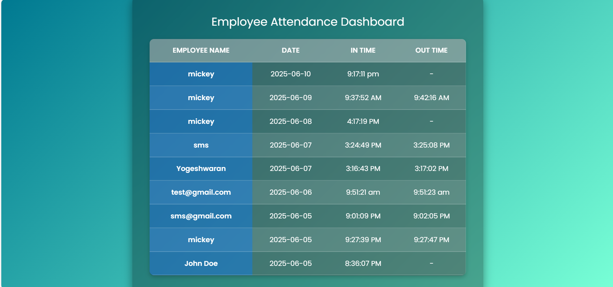
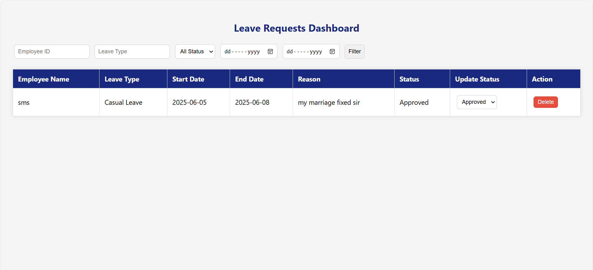
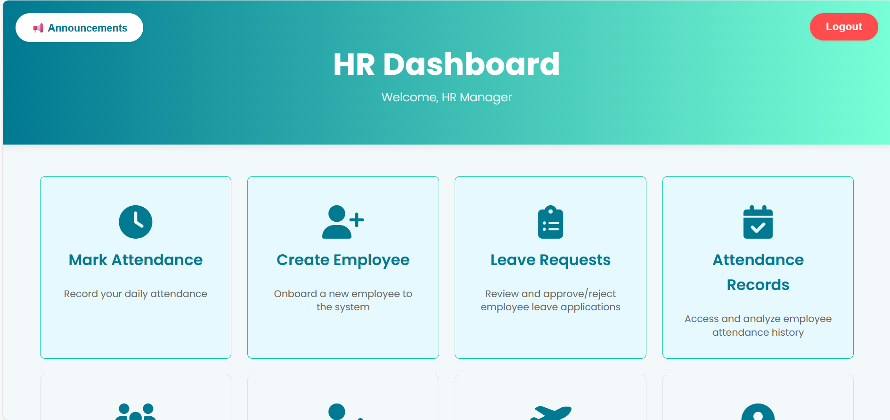

# Employee Management System 

A web-based Employee Management System (EMS) built using **HTML**, **CSS**, **JavaScript**, and **Firebase**. This system includes login authentication, role-based dashboards (Admin, HR, Employee), attendance tracking, and leave application management.

---

## 🔗 Live Project

🔗 **Access the Project Here**: [https://emstrail1.netlify.app](https://emstrail1.netlify.app).

##  Features

-  Firebase Authentication-based Login
-  Role-Based Access: Admin, HR, and Employee
-  Attendance Marking System
-  Leave Requests and Approvals
-  Real-Time Dashboard using Firestore
-  Responsive Design with Clean UI

##  Folder Contents

> All files are in single HTML files with embedded JavaScript and CSS. Here's an example of key pages:

- `index.html` – Landing/Login Page
- `admin_dash.html` – Admin features
- `hrdashboard1.html` – hr feautures
- `emp-trail2.html` – employee features

##  Tech Stack

- **Frontend**: HTML, CSS, JavaScript
- **Backend**: Firebase Authentication + Firestore
## 📸 Screenshots

### 🔐 Main  Page

### 🧑‍💼 Admin Dashboard

### 🕒 Attendance Page

### 📄 Leave Request Page

### HR DASHBOARD Page

---

-## 👥 Team Members

- **Mohan K** – Team Lead  
- **Suriya J** – Team Member  
- **I. Mickey Samuel** – Team Member  
- **A. Yokeshvaran** – Team Member

               
             

